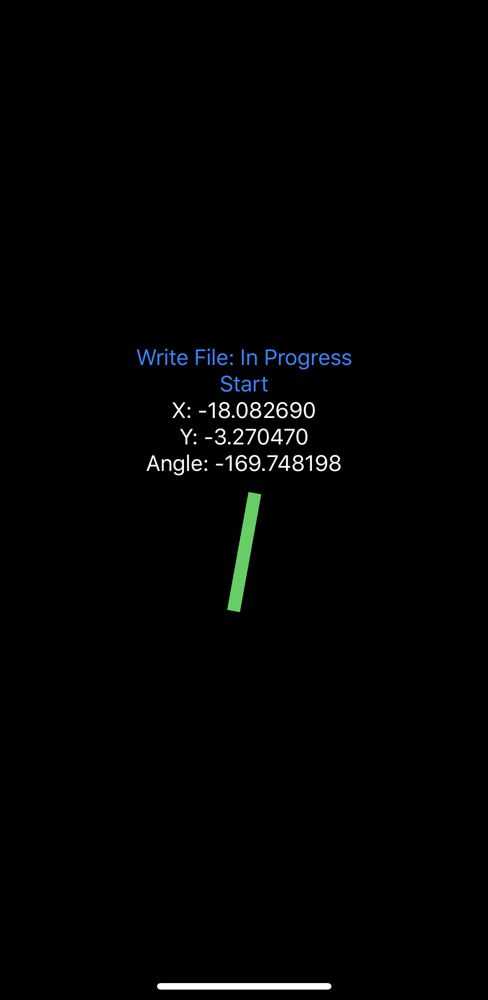

# Tilt-Master
Measuring tilt on IOS devices with Swift

Uses gyroscope and acceleromter on IOS devices to measure the exact tilt of the device.

Assume that a 0 tilt happens when the device is placed flat on surface (with screen on top).

## Run
Simply compile and run in xcode!

Post-processing folder contains python scripts that can be used to analyze the data obtained through the app. Details on how to collect those data are explained in the next section.

## Main interface
Here is the main interface of tilt-master. By pressing start, tilt-master will start measuring and recording accelerometer and gyroscope data. It will then use a complementary filter to measure tilt and display estimated tilt over `X` axis and over `Y` axis on screen.

`Angle` combines X and Y to rotate a rectangle that would point to current tilt orietation. The rectangle's length is deteremined by the sum of squares of x and of y, thus reflecting the 'severeness' of a tilt.

`Write File` allows users to export computed tilt measurement into a file. The file will contain all tilt calculated through acceleromter, gyroscope or the complementary filter over the first 5 minutes after `start` is pressed. This file can be easily exported through airdrop for future analysis. Note that when 5 minutes have passed since `start` was pressed, the app will stop recording any more data and `Write File: In Progress` will change into `Write File: Ready!`, i.e. ready to export.

## Requirement
This code uses SwiftUI, so it requires target devices to be at IOS 13 or later.

## Limitations
This code has been tested thoroughly on iPad 6th generation and iPhone 10.
